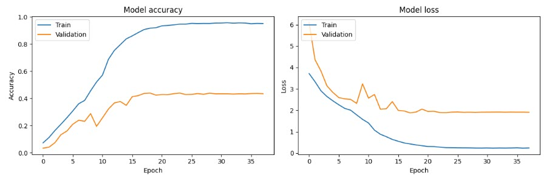

# Project 3: Image Classifier - Warblers
#### November 19, 2024

### Authors
Danielle Dejean\
Baruch Gottesman\
Kaidon Kennedy\
Carolyn Scheese\
Harpreet 'Monty' Singh

### Acknoweldgements 
Special thanks to Bill Parker (Instructor) & Sean Myers (TA) for help trouble shooting this project and it's various parts. 
Note: X-Pert, ChatGPT & Google Colab AI were used in creating this project. 

### Technical Skills
- Jupyter Notebook
- Python
- Selecting & Preparing the Data 
- Selecting a model 
- Scraping for Fun Facts
- Gradio App
- Streamlit app development

### Project Description 
The purpose of this project is to create a model that will classify images of at least 25 species of warblers (small birds) found on the North American Continent.
This model will then be the basis of two different apps (Prototypes) 1. Gradio app 2. Streamlit app that can then be used to classify uploaded images of warblers. These apps will display a few "fun facts" about the identified bird. 
                  
### Installation & Usage
- The files within the Project3_ImageClassification repo were updated using Python version 3.10.14, in Google Colab and Jupyter Notebook. To run it please download the most recent version of Python, as well as a code editor that runs Python (Visual Studio Code, PyCharm, etc.). 
- To run Google Colab, create and link your Google account, then open Google Drive - select "new >> more >> Google Colaboratory".
- Create Repo in GitHub. Include .gitignore for housing API keys in Streamlit

### Run Instructions:
    Terminal (Mac) or GitBash (Windows):
    Ensure that you're running the correct version of Python (see above)
    Ensure that you're in the directory containing the file before running

### Data Prep 
- Download .zip file from Kaggle.[Winged Wonders: The Birds-200](https://www.vision.caltech.edu/datasets/cub_200_2011/)
- Unzip. Extract files the 25 warbler species; folder numbers #158-#182 with their images. Save in a separate folder "bird_images_warbler"
Use the following code to extract the data from their individual folders, so that the images from each of the 25 warblers reside in a single folder. 

Import Libraries

Define the Path

Copy Initialize Variables & Save the df into a csv file 

### Creating the Model
Follow the code below and in the `Model.ipynb` file 

Import Libraries

Import Data Files 

Get sizes into list

Float images

Data Normalization

Augment Data set

Plot Accuracy & Model Loss

### Fun Facts
Follow the code in the 'Fun Facts Extraction.ipynb' file

## Gradio App- [Link](https://14685f404e70200cff.gradio.live/)
Import Libraries

Load trained Keras Model

Read in Fun Facts

Create the Gradio Interface

Launch the app

Image of app output 

      
## Streamlit App- [Link](https://14685f404e70200cff.gradio.live/)
NOTE: be sure your features are in the same order. 

### Top 4 Challenges 
1. ### Computational Constraints:
    - Achieving higher accuracy required additional epochs, deeper layers, or higher-resolution images, which demanded significant computational power.  
    - Limited GPU time in Google Colab further restricted the ability to train the model effectively.  

2. ### Dataset Challenges:
    - Working with a large dataset of 11,788 images resulted in time-intensive processes, such as uploading to Google Drive and image processing, even with a virtual T4 GPU and high RAM.  

3. ### Streamlit Application Issues:
    - Ensuring the correct ordering of classes to prevent inaccurate predictions due to mismatched indices.  
    - Importing and displaying fun facts accurately for the corresponding bird species required careful data handling and validation.  

4. ### Model Accuracy Considerations:
    - Variations in bird appearances—such as gender differences, adult versus juvenile stages, and seasonal changes—added complexity to accurate classification.  
    - With additional time, dividing bird categories further by these attributes could improve prediction accuracy and model robustness.  

### References 
1. [Original Data Source](https://www.vision.caltech.edu/datasets/cub_200_2011/)
2. [Winged Wonders: The Birds-200. Kaggle](https://www.vision.caltech.edu/datasets/cub_200_2011/)
3. [North American Warblers](https://www.birds-of-north-america.net/north-american-warblers.html)
4. [All About Birds-Comparing Similar Species](https://www.allaboutbirds.org/guide/Pine_Warbler/species-compare/65760791)
5. [Bing Fun Facts Search]("https://api.bing.microsoft.com/v7.0/search")
6. [Wikipedia API]("https://pypi.org/project/Wikipedia-API/")
